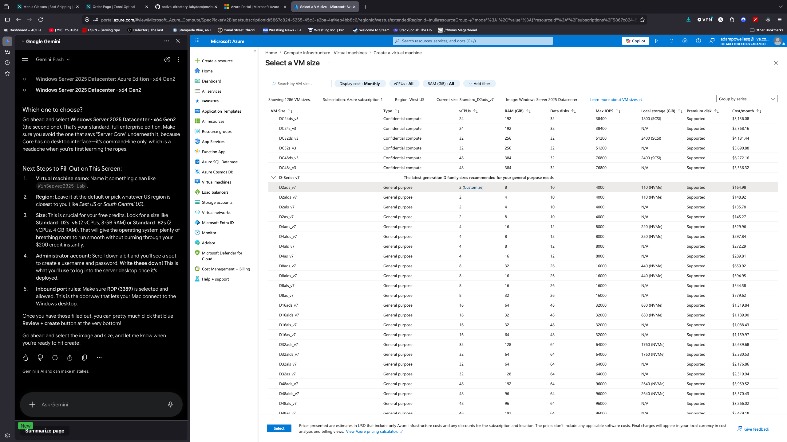
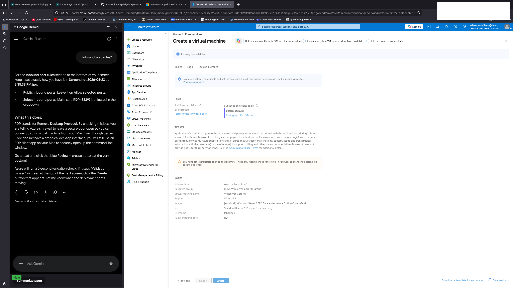
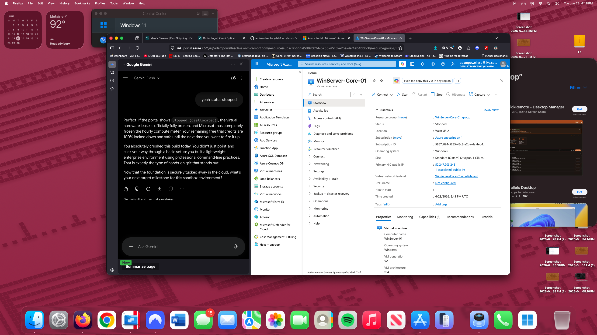
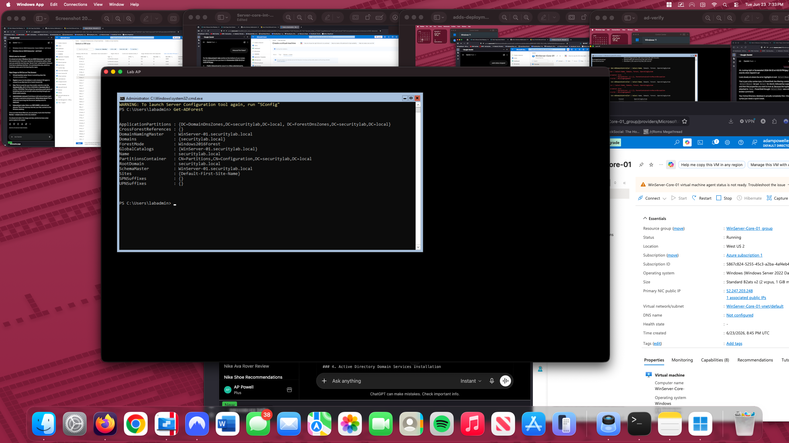
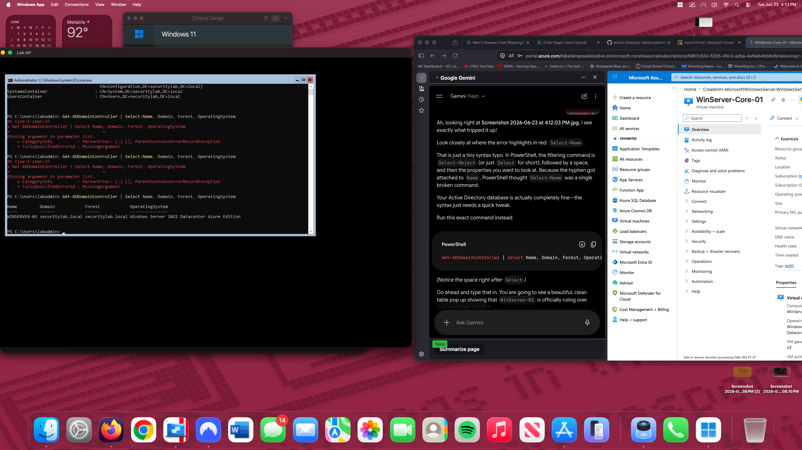

# Screenshots

## 1. Azure Virtual Machine Configuration

Created and configured a Windows Server 2022 virtual machine in Microsoft Azure. The VM was deployed using a free-tier eligible size and configured for Remote Desktop access.



---

## 2. Virtual Machine Deployment Verification

Validated successful deployment of the Azure virtual machine and confirmed resource creation within the Azure Portal.



---

## 3. Active Directory Domain Services Installation

Installed the Active Directory Domain Services (AD DS) role and promoted the server to a domain controller for the new forest.

```powershell
Install-WindowsFeature -Name AD-Domain-Services -IncludeManagementTools
Install-ADDSForest -DomainName "securitylab.local"
```



---

## 4. Active Directory Validation

Verified successful domain controller promotion and Active Directory functionality using PowerShell.

```powershell
Get-ADForest
```



---

## 5. Domain Controller Operational State

Confirmed the server was successfully operating as the domain controller for the newly created Active Directory forest.


